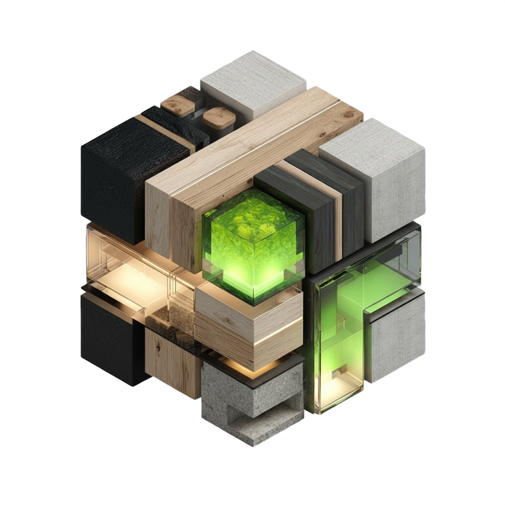
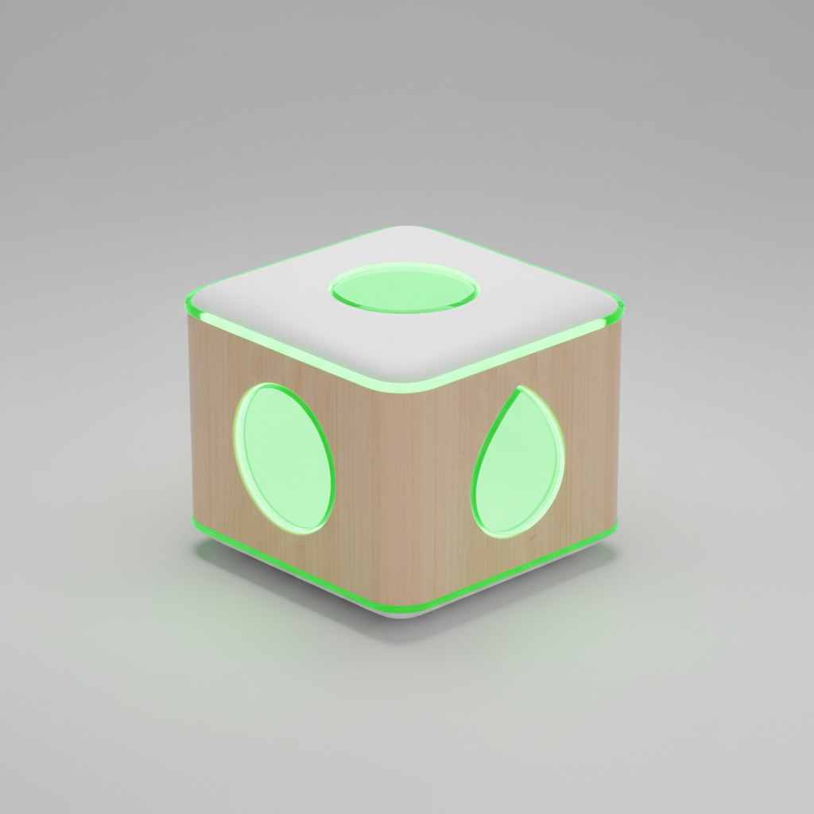
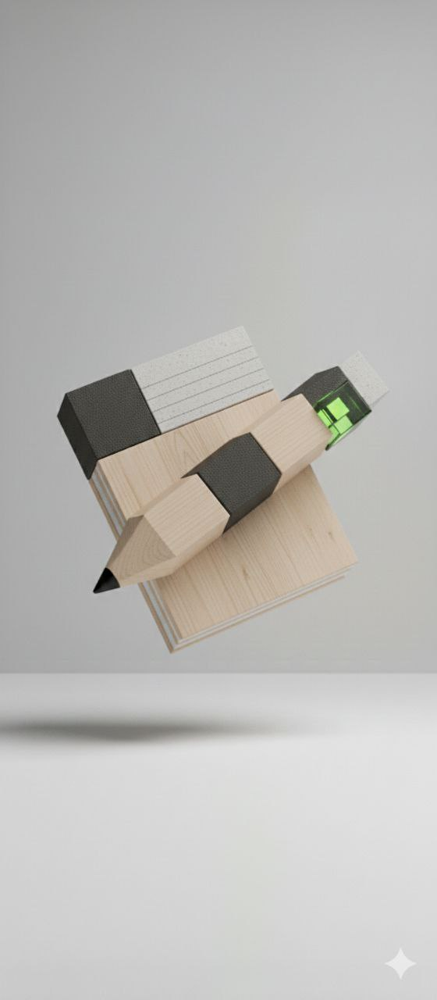
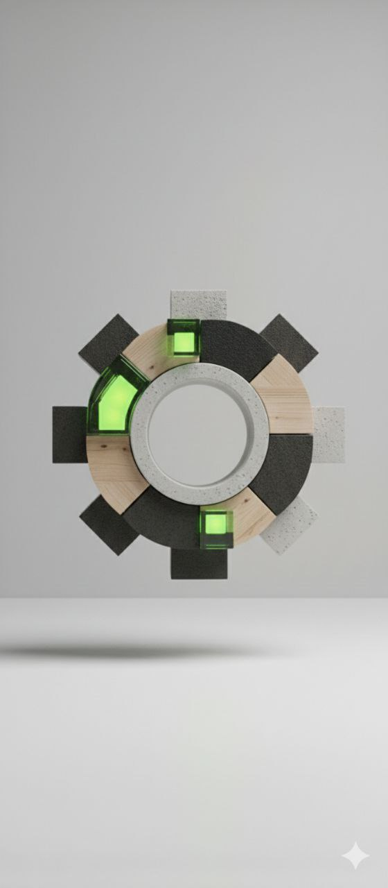

# SobirAI Landing

> Production landing page for SobirAI, an AI platform that helps manufacturing teams prepare drawings, specifications, and 3D models for custom products.



## Overview

SobirAI Landing is a Vite + React single-page website for presenting the SobirAI product, collecting leads, and explaining the workflow from customer request to engineering documentation.

The repository contains both the editable source project and the exact production build currently used for Vercel deployment.

## Highlights

- AI product positioning for manufacturing and custom production workflows.
- Animated landing page built with React, Tailwind CSS, GSAP, and Motion.
- Local TT Travels and Doloman fonts bundled in `public/fonts`.
- Product visuals, 3D model previews, drawings, BOM imagery, and video assets.
- Vercel-ready deployment using the exact live static build from `deployed/`.

## Preview

| Product | Workflow |
| --- | --- |
|  |  |
|  |  |

## Tech Stack

- React 18
- Vite
- Tailwind CSS
- GSAP + ScrollTrigger
- Motion
- Radix UI primitives
- Vercel

## Project Structure

```text
.
├── src/                 # React source code, components, styles, utilities
├── assets/              # Source images, SVG files, and video used by Vite
├── public/              # Static files copied by Vite, including fonts
├── deployed/            # Exact live static build used by Vercel
├── index.html           # Vite HTML template
├── package.json         # Scripts and dependencies
├── tailwind.config.js   # Tailwind configuration
├── vite.config.js       # Vite configuration
└── vercel.json          # Vercel build and routing configuration
```

## Getting Started

Install dependencies:

```bash
npm install
```

Start the development server:

```bash
npm run dev
```

Open `http://localhost:5173`.

## Build

Build from source:

```bash
npm run build
```

Preview the source build:

```bash
npm run preview
```

## Vercel Deployment

Vercel is configured to deploy the exact live build from `deployed/`:

```bash
npm run build:vercel
```

This copies `deployed/` into `dist/`, and Vercel serves `dist/` as the production output.

This setup preserves the current production landing page exactly while keeping the editable source code in the same repository.

## Notes

- `src/` contains the editable React codebase.
- `deployed/` contains the exact live build that matches the previous VPS deployment.
- `dist/` is generated locally and is intentionally ignored by Git.
- Large media files are part of the landing experience and are committed intentionally.

## Repository

GitHub: [keeendaaa/sobirai_landing](https://github.com/keeendaaa/sobirai_landing)
