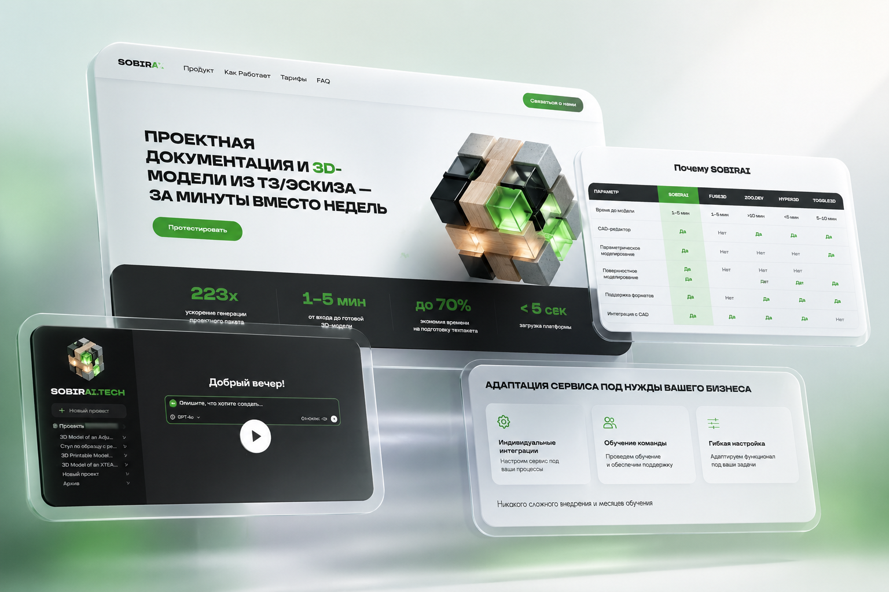
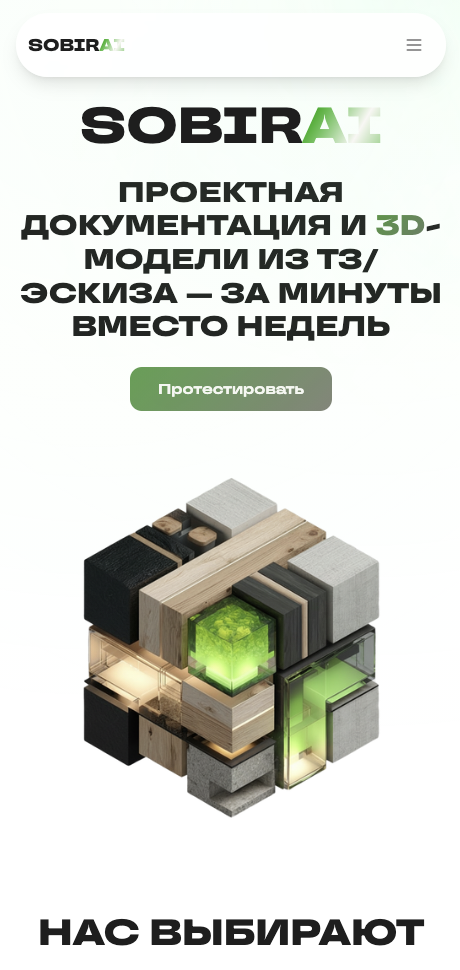
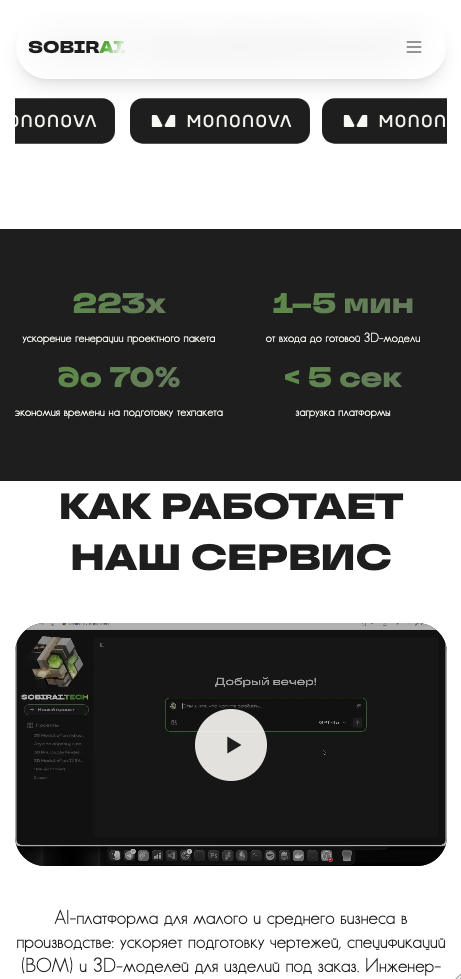
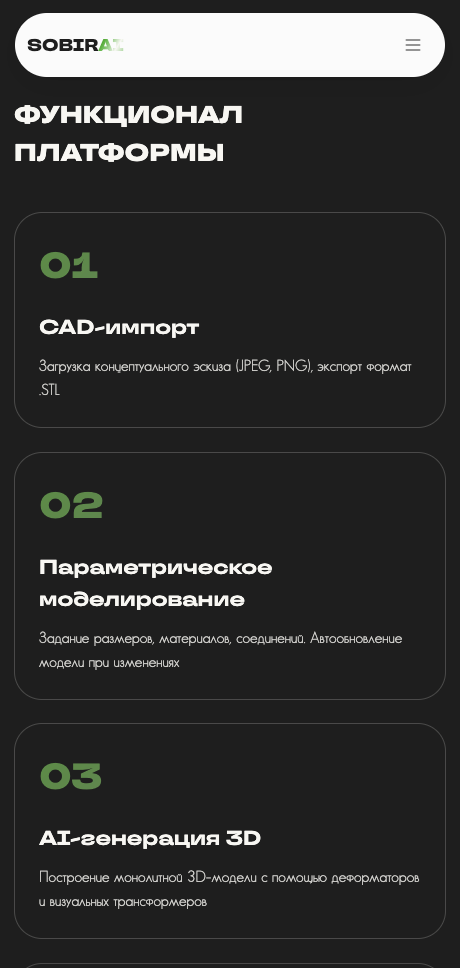
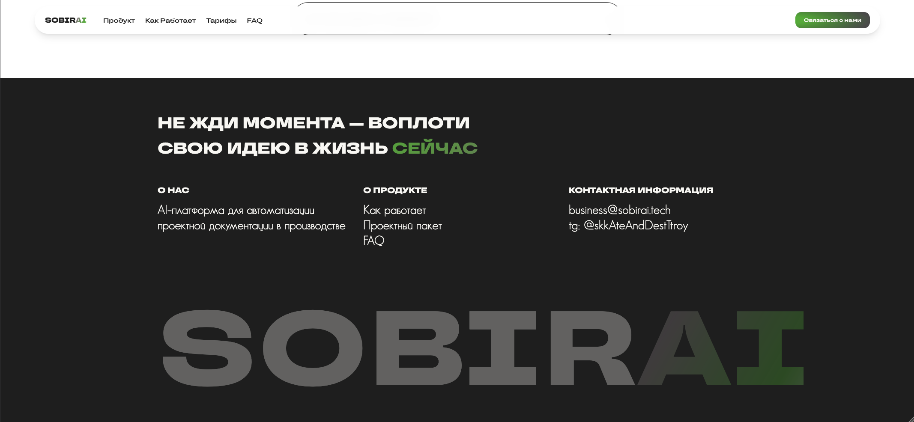

# SobirAI Landing



| | |
| --- | --- |
|  |  |
|  |  |

> 🚀 Лендинг SobirAI — AI-платформы для производственных компаний, которая помогает быстрее готовить чертежи, спецификации и 3D-модели для изделий под заказ.

## О проекте

SobirAI Landing — это одностраничный продуктовый сайт для презентации AI-платформы SobirAI. Лендинг объясняет ценность продукта для малого и среднего производственного бизнеса: сокращение ручной подготовки технической документации, ускорение обработки заявок и упрощение перехода от клиентского запроса к инженерным артефактам.

С технической точки зрения проект построен как React-приложение на Vite с Tailwind CSS, анимациями, локальными шрифтами и статическими медиа-ассетами. Репозиторий хранит редактируемую кодовую базу, исходные изображения и отдельную папку с точной production-сборкой, которая используется для деплоя на Vercel.

## Что внутри

- 🤖 Продуктовый лендинг для AI-сервиса в сфере производства и кастомных изделий.
- 🧩 Компонентная React-структура: страницы, навигация, UI-компоненты, хуки и утилиты.
- 🎨 Tailwind CSS, кастомные CSS-секции, локальные шрифты TT Travels и Doloman.
- ✨ Анимации и интерактивность через GSAP, ScrollTrigger и Motion.
- 🎬 Оптимизированное web-safe MP4-видео для корректного воспроизведения на Vercel и в браузерах.
- 🖼️ Изображения, SVG, мокапы, 3D-превью и production-assets, разложенные по папкам.
- ▲ Vercel-конфигурация с деплоем точной live-сборки из `deployed/`.

## Технический стек

- React 18
- Vite
- Tailwind CSS
- GSAP + ScrollTrigger
- Motion
- Radix UI primitives
- TypeScript в отдельных UI/helpers-файлах
- Vercel

## Структура проекта

```text
.
├── src/                 # React-код, компоненты, стили, хуки и утилиты
├── assets/              # Исходные изображения, SVG и видео для Vite-сборки
├── assets/raw/          # Дополнительные исходные изображения и legacy-медиа
├── public/              # Статические файлы, включая локальные шрифты
├── deployed/            # Точная live-сборка, используемая Vercel
├── docs/mockups/        # Мокапы сайта для README
├── index.html           # HTML-шаблон Vite
├── package.json         # Скрипты и зависимости
├── tailwind.config.js   # Конфигурация Tailwind CSS
├── vite.config.js       # Конфигурация Vite
└── vercel.json          # Настройки сборки и роутинга для Vercel
```

## Локальный запуск

Установить зависимости:

```bash
npm install
```

Запустить dev-сервер:

```bash
npm run dev
```

Открыть сайт:

```text
http://localhost:5173
```

## Сборка

Собрать проект из исходников:

```bash
npm run build
```

Локально посмотреть production-сборку из исходников:

```bash
npm run preview
```

## Деплой на Vercel

Для production-деплоя Vercel использует команду:

```bash
npm run build:vercel
```

Она копирует `deployed/` в `dist/`, после чего Vercel публикует `dist/` как финальный статический сайт.

Такой режим нужен потому, что `deployed/` содержит точную live-версию лендинга, перенесённую с предыдущего VPS. Это позволяет безопасно мигрировать сайт на Vercel, не теряя текущий production-визуал, и параллельно сохранять редактируемую React/Vite-кодовую базу в `src/`.

## Важные заметки

- `src/` — редактируемая кодовая база проекта.
- `deployed/` — точная production-сборка, которую сейчас деплоит Vercel.
- `dist/` генерируется локально и не хранится в Git.
- Крупные медиафайлы закоммичены намеренно, потому что они являются частью лендинга.
- Видео перекодировано в `H.264/avc1 + AAC`, чтобы корректно работать в браузерах и на Vercel.

## Репозиторий

GitHub: [keeendaaa/sobirai_landing](https://github.com/keeendaaa/sobirai_landing)
